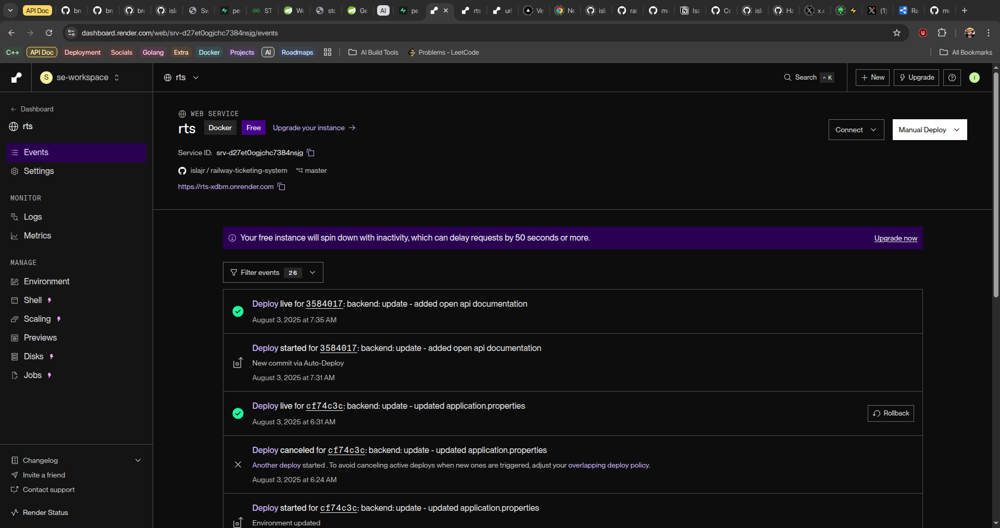

# Railway Ticketing API Service

This is a REST API that helps users search for train schedules, make reservations and manage them.

<!-- The detailed documenation available at: <https://documenter.getpostman.com/view/34198518/2sB3BAMsWh> -->

## Included Features

The features included within the current release of the API include:

- Passenger Creation and Authentication
- Passenger Seat Selection
- Admin Creation and Authentication
- Role-based Access Control
- Train Creation
- Reservation Creation and Deletion
- Schedule Creation, Querying, Edition and Deletion

## Entity Relationship Diagram

This is the attached ER Diagram for the current release. PDF Version is available [here](<Railway Ticketing System ER Diagram.pdf>)

## Project Screenshot

This is a screenshot of the project, live on render at <https://rts-xdbm.onrender.com>.

